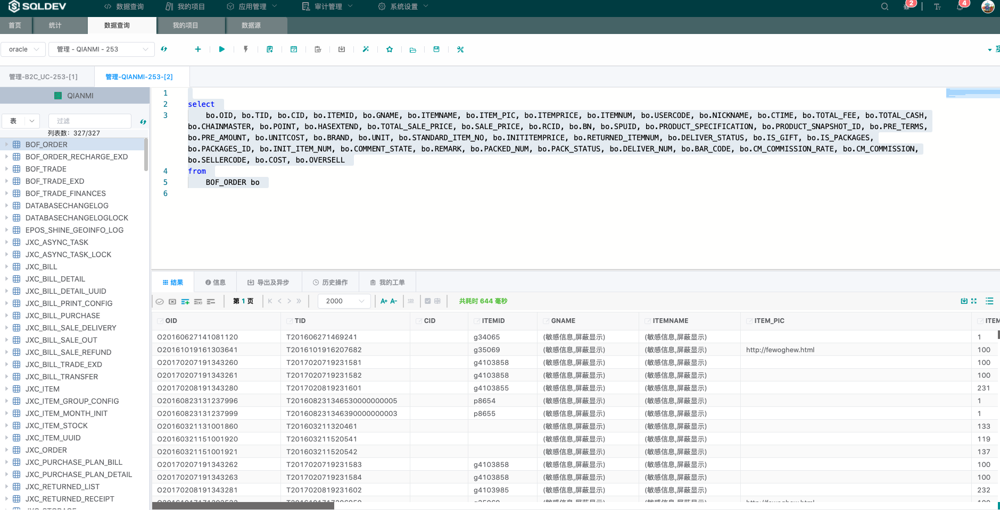

<h1 align="center">Welcome to SQLDEV </h1>

[**简体中文**](README.md) · [**English**](./README_EN.md)

        

# SQLDev 企业数据库统一管理服务平台

  
  
  
  

SQLDEV(SQL Developer)是一款数据访问、数据脱敏、权限管控、操作审计为一体的数据库安全运维工具平台

**[产品官网](https://sqldev.info/)**

**[使用文档](https://shuaninfo.github.io/sqldevdoc/)**

**[下载地址](https://github.com/shuaninfo/sqldev/releases)**

## 主要功能

- 执行SQL(DQL/DML/DDL/TCL)

- 数据导入/导出

- 自动补全，智能提示

- 审计、拦截、告警

- 敏感数据动态脱敏

- 告警通知(MAIL、短信、IM)

- 细粒度权限管控（字段级别/行级管控）

- 支持多项目多角色

- 支持定制工单触发场景和审核流程

- 支持数据库引擎：Oracle、MySQL、MongoDB、MS SQL、DB2、TDEngine、Hive、Redis、DaMeng、TIDB、ClickHouse、Greenplum、MariaDB 等

- 支持部署环境：自有机房、阿里云、aws、腾讯云

- 支持信创环境及中间件部署

- 支持集成第三方登录（CAS/LDAP/OAUTH2)
      

## 效果展示

- 用户登录

- 平台统计

- 数据脱敏

- 语法补全

- 数据查询

- 数据更新

- 日志审计

- 细粒度的权限分配

- 工单流程

## 技术支持
   Sqldev (Go) 使用交流     WeChat: freeman983

扫描二维码，添加小助手后拉您进群

2020 © sqldev.info

