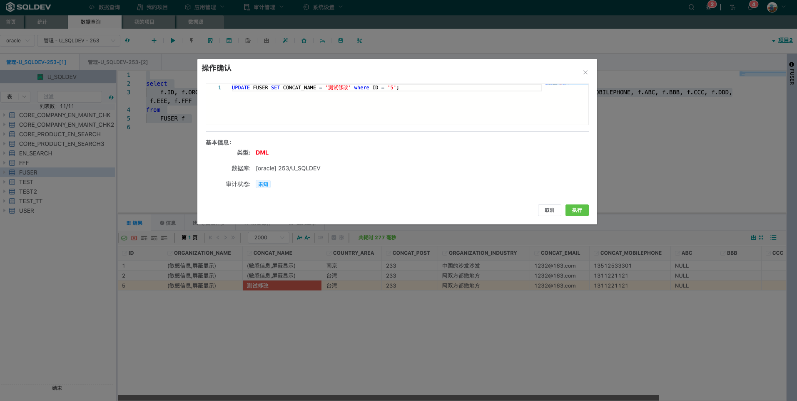

<h1 align="center">Welcome to SQLDEV </h1>

[**简体中文**](README.md) · [**English**](./README_EN.md)

    
    

# SQLDev Enterprise Database Unified Management Service Platform

    
    
    
    
        

        SQLDEV (SQL Developer) is a database security operation and maintenance tool platform that integrates data access, data desensitization, permission control and operation audit.

**[Website](https://sqldev.info/)**

**[Document](https://shuaninfo.github.io/sqldevdoc/)**

**[Download](https://github.com/shuaninfo/sqldev/releases)**

## Main Features

- Execution of SQL (DQL/DML/DDL/TCL)

- Data import/export

- Auto-completion, intelligent prompting

- Auditing, interception, alerting

- Dynamic desensitization of sensitive data

- Alarm notification (MAIL, SMS, IM)

- Fine-grained permission control (field-level/line-level control)

- Support multi-project and multi-role

- Support custom work order trigger scenarios and audit process

- Support for database engines: Oracle, MySQL, MongoDB, MS SQL, DB2, TDEngine, Hive, Redis, DaMeng, TIDB, ClickHouse, Greenplum, MariaDB, etc.

- Support deployment environment: own server room, Ali cloud, aws, Tencent cloud

- Support integrated third-party login (CAS/LDAP/OAUTH2)

## Effect demonstration

- User Login

- Platform Statistics

- Data Desensitization

- Syntax Complementation

- Data query

- Data Update

- Log Auditing

- Fine-grained permission assignment

- Work Order Flow

## Technical Support
Sqldev (Go) Usage Exchange WeChat: freeman983

Scan the QR code, add the assistant and pull you into the group

2020 © sqldev.info

Translated with www.DeepL.com/Translator (free version)